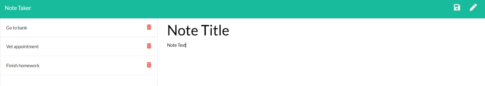

# Team Dashboard Builder   
Manage your daily notes with the Note Taker application. Note Taker will allow the user to enter new notes, save, view and delete. The application is powered by Express.js.

## Table of Contents
  * [Deployment](#Deployment)

  * [Resources](#Resources)

  * [Questions](#Questions)

  * [License](#License)

## Deployment
Use application at [Heroku]()

View project repository at [Github](https://github.com/ShaylaStevenson/note-taker)

## Resources
* The support of the teaching staff and class members
* Class activities i.e. Star Wars and Hot Restaurants
* [Heroku](https://heroku.com/)
* [Stack Overflow](https://stackoverflow.com/)
* [Express.js documents](https://expressjs.com/)
* [NPM documents](https://docs.npmjs.com/)

## Questions
Don't hesitate to reach out 
  * Github Username: ShaylaStevenson
  * [View Github Profile](https://github.com/ShaylaStevenson)
  * Email: shayla.rose.stevenson@gmail.com
  
## License
This project is licensed under the terms of the MIT license. View license at:
https://opensource.org/licenses/MIT.

